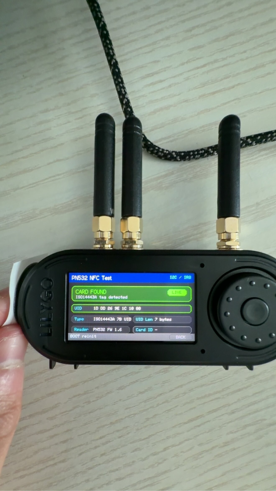

1. Please visit https://github.com/Xinyuan-LilyGO/T-Embed-CC1101/tree/master/firmware to download and flash the `T_Embed_CC1101_HW_V1.0_SW_V1.0.0.bin` firmware.
2. Follow the instructions at https://github.com/Xinyuan-LilyGO/T-Embed-CC1101/blob/master/docs/flash_download_tool.md to flash the firmware.
3. After flashing is complete, press the reset button to ensure the device boots up.
4. Navigate to the NFC function page in the menu and press the center button to enter it.
5. Hold the included NFC card near the side of the device opposite the USB-C port (the antenna is located on the side opposite the USB-C port); if the card is detected, the screen should display the card's contents.
If it still does not work, please record a video following the steps above to serve as evidence for a return.

---
1. 请打开此链接https://github.com/Xinyuan-LilyGO/T-Embed-CC1101/tree/master/firmware 下载写入 T_Embed_CC1101_HW_V1.0_SW_V1.0.0.bin 固件 
2. 按照此链接 的方法将固件写入  https://github.com/Xinyuan-LilyGO/T-Embed-CC1101/blob/master/docs/flash_download_tool.md
3. 写入完成之后按下复位按键,确保设备已经启动
4. 然后在菜单中选择NFC功能页面，然后按中间按键进入这个菜单
5. 然后使用附送的NFC卡片靠近设备的USBC的另一侧，因为天线位置在USBC的对侧，正常情况如果检测到卡片，屏幕会显示卡片的内容
如果还是无效，请按照上述方法拍摄视频作为退货的依据